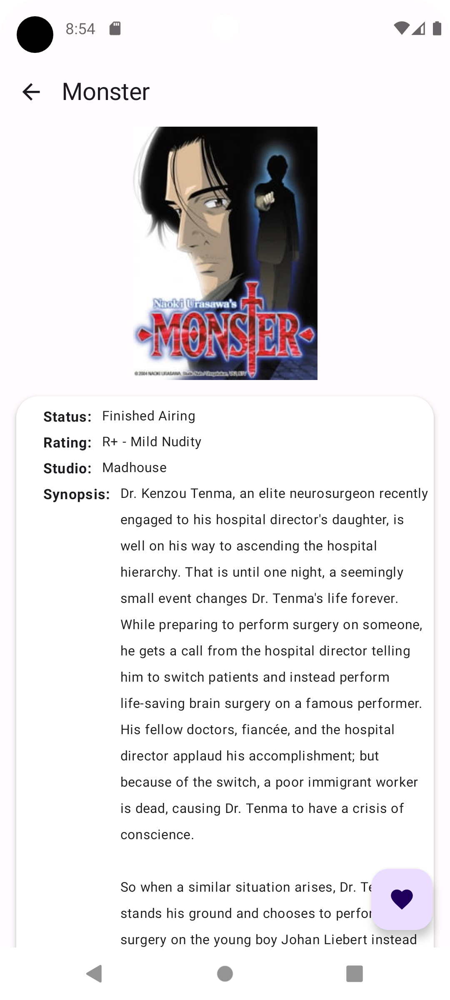
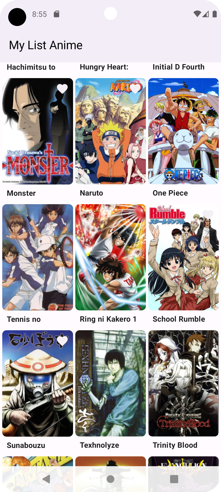

## __MY LIST ANIME__

### __ABOUT__

### App from course Architect Coders. Made with jetpack compose, with the aim of using good practices, clean architecture, dependency injection, testing.

## __FEATURES__

* List of animes on home, see details of each listed one

## __DEVELOPMENT__

* screens with compose
* ViewModel and data from api.
* ViewModel UI with StateFlow, navigation.
* repository, datasources, bd room. reactive ui.
* clean arquitecture with modules and convention plugins.
* dependency injection hilt.
* Unit test useCases, repository, homeViewModel, InfoAnimeViewModel.
* Integration test for homeViewModel and InfoAnimeViewModel. fakes with buildAnimesRepositoryWith.
* UI Screen Test in compose with compose Rule(hilt,room,mockwebserver).

### __MY LIST ANIME SCREENSHOTS__

